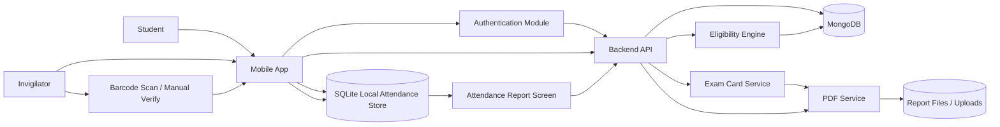
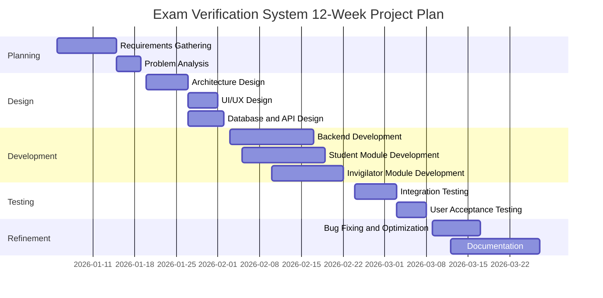

# SOUTH EASTERN KENYA UNIVERSITY

## SCHOOL OF SCIENCE AND COMPUTING

### Exam Administration Verification System: Secure Digital Exam Card Generation and Real-Time Exam Attendance Verification Platform for Universities

**Project Author**  
Robert Muendo  
G127/2341/2021

**Programme**  
Bachelor of Science in Information Technology

**Supervisor**  
Obwaya Mogire

**Month and Year of Submission**  
April 2026

**Submission Statement**  
A research project report submitted to the School of Science and Computing in partial fulfillment of the requirements for the award of the degrees of Bachelor of Science in Information Technology and Bachelor of Science in Computer Science at South Eastern Kenya University.

---

## Declaration

This research project report is my original work and has not been presented in any other university or institution for academic award. All sources of information used in this work have been duly acknowledged.

**Student Name:** Robert Muendo  
**Reg. No.:** G127/2341/2021  
**Signature:** ****\*\*****\_\_****\*\*****  
**Date:** ****\*\*****\_\_****\*\*****

**Supervisor's Approval**  
This research project report has been submitted for examination with my approval as the university supervisor.

**Supervisor Name:** ****\*\*****\_\_****\*\*****  
**Signature:** ****\*\*****\_\_****\*\*****  
**Date:** ****\*\*****\_\_****\*\*****

---

## Dedication

This work is dedicated to my parents, guardians, lecturers, and mentors for their support throughout my undergraduate studies. It is also dedicated to university students and invigilators whose day‑to‑day examination experiences motivated the development of a more secure, accountable, and efficient exam verification process.

---

## Acknowledgment

I sincerely thank my project supervisor for the guidance, technical insight, and academic support offered throughout the project period. I also appreciate the support of the School of Science and Computing, my classmates, and colleagues who provided feedback during requirements gathering, testing, and refinement of the system. Finally, I am grateful to my family and friends for their encouragement, patience, and motivation during the entire project development process.

---

## Abstract

Universities continue to experience major operational difficulties during examination periods due to fragmented and manual processes for student eligibility verification, exam card issuance, and attendance recording. Physical examination card inspection is often slow, inconsistent, and prone to human error, while manual attendance sheets are difficult to reconcile and provide weak auditability in cases of disputes or compliance reviews. This project developed the **Exam Administration Verification System (EVS)**, a mobile‑centered digital platform for secure exam card generation and real‑time attendance verification.

The system was designed as a full‑stack solution consisting of a React Native mobile application for students and invigilators, a Node.js/Express backend API, MongoDB‑based persistent storage, and a mobile SQLite layer for offline attendance persistence and report preparation. The student module supports authentication, automated eligibility checking, lecturer evaluation submission, attendance timetable management, secure digital exam card generation, and exam card download or sharing. The invigilator module supports unit selection, barcode‑based verification, manual fallback verification, local attendance capture, and PDF attendance report generation. The backend centralises business logic for authentication, eligibility enforcement, exam card lifecycle management, verification, and report generation.

The project adopted a design‑science research orientation and an agile incremental prototyping approach structured around classical software development phases of requirements analysis, design, implementation, testing, deployment preparation, and maintenance planning. Data for requirements analysis was derived from stakeholder needs, document analysis, and workflow examination of existing examination processes. The implemented system addresses four core eligibility conditions before exam card generation: minimum attendance threshold (≥70%), zero fee balance, completed lecturer evaluations, and existence of registered units.

The developed system demonstrates that digital exam verification can reduce congestion, improve consistency in rule enforcement, strengthen audit trails, and simplify attendance reporting. The major outputs include a functional mobile application, secure role‑based APIs, downloadable exam card PDFs, verification logs, and invigilator attendance reports. The study concludes that an integrated digital exam verification workflow is feasible and operationally valuable for universities. It recommends pilot deployment, integration with institutional ERP services, enhancement of analytics dashboards, and future cloud deployment with stronger infrastructure support.

---

## Definition of Terms

- **Exam Verification System (EVS)** – A digital platform that manages exam eligibility checking, exam card generation, student verification, and attendance reporting.
- **Eligibility Check** – Automated validation of whether a student meets all requirements to generate an exam card.
- **Digital Exam Card** – A system‑generated and time‑bound examination authorisation document containing machine‑readable barcode data.
- **Invigilator** – An authorised examination officer who verifies students and records attendance during examinations.
- **Lecturer Evaluation** – A structured student feedback submission process used as one of the prerequisites for exam card generation.
- **Offline‑First Storage** – A design approach where essential records are stored locally on the device to maintain operation during poor or unavailable internet connectivity.
- **Verification Log** – A traceable record containing details of exam verification events such as user, time, method, and outcome.
- **Attendance Timetable** – A student‑configured weekly class schedule used by the system to monitor and compute attendance percentages.
- **Audit Trail** – A chronological record of events that supports traceability, accountability, and post‑exam review.
- **JWT Authentication** – A token‑based security mechanism used to authorise system requests after successful login.

---

## List of Abbreviations/Acronyms

| Abbreviation | Full Form                                |
| ------------ | ---------------------------------------- |
| API          | Application Programming Interface        |
| DBMS         | Database Management System               |
| DFD          | Data Flow Diagram                        |
| EVS          | Exam Verification System                 |
| ICT          | Information and Communication Technology |
| JWT          | JSON Web Token                           |
| PDF          | Portable Document Format                 |
| QA           | Quality Assurance                        |
| QR           | Quick Response                           |
| SQL          | Structured Query Language                |
| TLS          | Transport Layer Security                 |
| UAT          | User Acceptance Testing                  |
| UI           | User Interface                           |
| UX           | User Experience                          |
| WAL          | Write‑Ahead Logging                      |

---

# Table of Contents

_[Page numbers will be generated automatically upon conversion to .docx]_

[Declaration](#declaration)  
[Dedication](#dedication)  
[Acknowledgment](#acknowledgment)  
[Abstract](#abstract)  
[Definition of Terms](#definition-of-terms)  
[List of Abbreviations/Acronyms](#list-of-abbreviationsacronyms)  
[List of Tables](#list-of-tables)  
[List of Figures](#list-of-figures)  
[CHAPTER 1: INTRODUCTION](#chapter-1-introduction)  
[CHAPTER 2: LITERATURE REVIEW](#chapter-2-literature-review)  
[CHAPTER 3: RESEARCH DESIGN AND METHODOLOGY](#chapter-3-research-design-and-methodology)  
[CHAPTER 4: SYSTEM ANALYSIS AND DESIGN](#chapter-4-system-analysis-and-design)  
[CHAPTER 5: SUMMARY OF FINDINGS, CONCLUSIONS AND RECOMMENDATIONS](#chapter-5-summary-of-findings-conclusions-and-recommendations)  
[References](#references)  
[Appendices](#appendices)

---

## List of Tables

- Table 1: Stakeholder Needs Analysis Summary ................................... 18
- Table 2: User Roles and Functional Responsibilities ........................... 20
- Table 3: Functional Requirements Summary ...................................... 21
- Table 4: Non‑Functional Requirements Summary .................................. 22
- Table 5: Backend `students` Collection Design ................................. 25
- Table 6: Backend `users` Collection Design .................................... 26
- Table 7: Backend `examcards` Collection Design ................................ 26
- Table 8: Backend `lecturerevaluations` Collection Design ...................... 27
- Table 9: Backend `verificationlogs` Collection Design ......................... 28
- Table 10: Backend `pdfreports` Collection Design .............................. 28
- Table 11: Backend `passwordresettokens` Collection Design ..................... 29
- Table 12: Mobile SQLite `attendance_records` Table Design ..................... 29

---

## List of Figures

- Figure 1: Level 1 Data Flow Diagram ........................................... 23
- Figure 2: Use Case Diagram .................................................... 24
- Figure 3: Student Login Screen ............................................... 42
- Figure 4: Student Dashboard .................................................. 42
- Figure 5: Student Exam Card Screen ........................................... 43
- Figure 6: Invigilator Scan Screen ............................................ 43
- Figure 7: Invigilator Reports Screen ......................................... 44
- Figure 8: Project Gantt Chart ................................................ 48
- Figure 9: Eligibility Logic Code Snippet ..................................... 49
- Figure 10: Local Attendance Storage Code Snippet ............................. 50

---

# CHAPTER 1: INTRODUCTION

## 1.1 Background of the Study

University examination administration depends on accurate identification of students, confirmation of academic and administrative eligibility, and reliable attendance records. In many institutions, these functions are still handled as separate manual processes. Students are cleared for examinations through fragmented interactions involving departments, finance offices, and examination offices. Invigilators then rely on visual inspection of printed cards and handwritten attendance sheets during the actual examination session. This arrangement is slow, inconsistent, and difficult to audit.

The growth of student populations and increased pressure on institutional accountability have made traditional exam verification approaches inadequate. During examination periods, large numbers of students must be screened within short time windows. Where verification is manual, queues form quickly, unauthorised students may evade detection, and attendance records may contain omissions or inconsistencies. These risks affect examination integrity and increase the administrative burden placed on invigilators and examination offices.

Digital transformation provides an opportunity to reorganise these workflows into a single controlled process. Mobile applications, secure authentication, barcode‑based verification, automated eligibility rules, and digital report generation can reduce human error and improve turnaround time. In the context of higher education, such a system supports operational efficiency, accountability, and better student experience.

The Exam Administration Verification System was developed in response to this need. The system integrates student eligibility assessment, digital exam card generation, invigilator verification, local attendance persistence, and report generation into one coordinated platform. The project combines mobile computing, web APIs, database design, and digital document generation to address a real institutional problem.

## 1.2 Problem Statement

The current examination entry and verification process is fragmented, manual, and inefficient. Physical inspection of exam cards by invigilators causes delays and congestion at examination venues, while manual attendance sheets are difficult to reconcile, prone to loss, and provide weak traceability. In addition, exam eligibility checks such as fee clearance, attendance thresholds, lecturer evaluation completion, and unit registration are often handled as separate administrative processes rather than one enforceable workflow. This creates duplication of effort, inconsistent rule enforcement, and increased risk of unauthorised exam access. A digital, integrated, secure, and auditable exam verification platform is therefore required.

## 1.3 Objectives

### General Objective

To design and implement a secure digital platform for exam card generation and real‑time exam attendance verification in universities.

### Specific Objectives

1. To design and implement a secure exam verification workflow using barcode scanning and manual fallback for invigilators.
2. To develop a student eligibility module that validates attendance, fee clearance, lecturer evaluations, and unit registration before exam card generation.
3. To generate unique, time‑bound digital exam cards in PDF form for eligible students.
4. To implement attendance capture and authenticated report generation for invigilators.
5. To provide a traceable audit mechanism through stored verification and attendance records.
6. To improve the speed, consistency, and accountability of examination verification activities.

## 1.4 Research Questions

1. How can digital verification reduce delays and inconsistencies in examination entry processes?
2. How can exam eligibility rules be centralised and enforced before exam card generation?
3. How can mobile and backend technologies improve traceability and auditability during examinations?
4. How can offline‑first attendance capture support verification continuity during poor network conditions?
5. How can automated PDF generation reduce the burden of post‑exam attendance reconciliation?

## 1.5 Hypotheses

1. A digital exam verification workflow significantly reduces the time required to verify students compared to manual card inspection.
2. Automated eligibility enforcement improves consistency in examination clearance decisions.
3. Barcode‑assisted verification and digital logs improve the traceability and auditability of examination attendance records.
4. Offline‑first attendance storage improves operational reliability during network interruptions.

## 1.6 Justification

The study is justified by the operational and administrative challenges currently experienced in university examination management. An integrated system offers value to students by improving transparency of eligibility status and access to exam cards. It benefits invigilators by reducing decision pressure and replacing paper‑based attendance tracking with structured digital records. It benefits the examinations office by improving audit readiness and shortening reconciliation time. The project is also academically justified because it applies software engineering, mobile computing, database systems, information security, and document generation techniques to solve a practical institutional problem.

## 1.7 Scope of the Study

This study focused on the design and implementation of a prototype mobile and backend solution for university exam verification. The scope included:

- student login and eligibility assessment;
- lecturer evaluation submission and tracking;
- exam card generation, download, preview, and deletion;
- invigilator authentication and unit‑based student verification;
- local attendance storage on the mobile device;
- attendance report generation in PDF format;
- backend APIs for authentication, verification, and report handling.

The project did not cover enterprise integration with a live university ERP, finance platform, or production hosting environment. The system was developed and tested as a prototype suitable for pilot deployment.

---

# CHAPTER 2: LITERATURE REVIEW

## 2.1 Introduction

This chapter reviews theoretical and analytical literature relevant to the design of a secure digital examination verification system. The review focuses on information systems theory, system adoption, design‑science research, digital authentication, QR or barcode‑enabled verification, and audit‑oriented attendance management. The goal is to identify concepts that support the development of an integrated examination workflow and to establish the research gap addressed by the project.

## 2.2 Review of Theoretical Literature

**Design Science Research Theory** – Design science research emphasises the creation and evaluation of technological artefacts intended to solve identified organisational problems. Hevner et al. (2004) argue that information systems research is strengthened when artefacts are purposefully designed, implemented, and evaluated in response to practical challenges. The Exam Administration Verification System aligns with this theory because it was developed as an artefact that addresses inefficiencies in exam clearance, student verification, and attendance reporting.

**Information Systems Success Model** – The DeLone and McLean Information Systems Success Model links system quality, information quality, service quality, use, user satisfaction, and net benefits (DeLone & McLean, 2003). In this project, system quality is reflected in response time, reliability, and usability; information quality is reflected in correct eligibility decisions and accurate attendance records; and net benefits are reflected in faster verification, reduced manual reconciliation, and improved auditability.

**Technology Acceptance Model** – The Technology Acceptance Model states that perceived usefulness and perceived ease of use influence acceptance of an information system (Davis, 1989). This project incorporates the model by simplifying the student and invigilator workflows into a small number of clear actions: login, verify status, generate or manage exam cards, scan student codes, and produce reports. These interface decisions support adoption by reducing complexity for the end user.

## 2.3 Review of Analytical Literature

Digital attendance and verification systems have been shown to improve efficiency, speed, and record integrity compared to manual processes. Baban (2014) demonstrated that QR‑based attendance systems can reduce administrative effort and give users timely access to attendance records. Although the cited work addressed classroom attendance rather than examination verification, it provides evidence that machine‑readable codes and mobile scanning can improve education administration workflows.

Security‑oriented technical literature also supports the architecture used in this project. JWT provides a standardised mechanism for secure token‑based authorisation across distributed applications (Jones et al., 2015). OWASP guidance on API security further emphasises the need for strong authentication, access control, and secure request handling in modern digital platforms (OWASP Foundation, n.d.). These principles are directly relevant to a system that manages student data, exam access, and report downloads.

Technical platform documentation also informs the implementation choices made in the project. React Native and Expo support cross‑platform mobile development, device hardware access, and rapid UI delivery. MongoDB provides flexible schema design for student, exam card, and evaluation data, while SQLite offers lightweight local storage suitable for offline attendance persistence. PDFKit supports programmatic PDF creation for exam cards and attendance reports. Together, these technologies make it practical to implement an integrated verification workflow using a mobile‑first architecture.

## 2.4 Research Gap

Existing examination management processes and many standalone attendance tools do not offer a unified workflow that enforces eligibility before card issuance, supports secure digital exam cards, and records attendance with immediate reporting capability. Many available attendance systems focus on classroom attendance rather than high‑stakes examination entry. Others provide scanning functionality without integrating fee clearance, attendance thresholds, lecturer evaluations, and unit registration into a single decision pipeline.

The gap addressed by this project is therefore the absence of a mobile‑centered, secure, auditable, and workflow‑driven examination verification solution that links pre‑exam eligibility, time‑bound digital card issuance, contextual invigilator verification, offline‑first attendance capture, and downloadable reporting within one platform.

---

# CHAPTER 3: RESEARCH DESIGN AND METHODOLOGY

## 3.1 Introduction

This chapter explains the research design, system development approach, target population, sampling strategy, data collection methods, and analysis procedures used in the project. The methodology was structured to support both technical implementation and academic evaluation of the resulting system.

## 3.2 Research Design

The study adopted a **design‑science and experimental prototype research design**. The design‑science orientation was appropriate because the project sought to build and evaluate a technological artefact that solves a real institutional problem. The experimental aspect was reflected in iterative implementation, testing, feature refinement, and user‑oriented validation of the resulting system modules.

## 3.3 System Development Approach

The project followed an **agile incremental prototyping approach** organised around the classical phases commonly associated with the Waterfall Model. This hybrid approach provided both flexibility and structure.

**Requirements Analysis** – At this stage, the team identified the problems in manual exam card verification, fragmented eligibility checks, and paper‑based attendance reconciliation. Stakeholder requirements were collected from the expected users and translated into functional and non‑functional requirements.

**System Design** – The team designed the overall architecture, user roles, API routes, database structures, verification flow, and interface structure for both student and invigilator modules. Diagrams and module boundaries were defined before implementation of the main services.

**Implementation** – Implementation was carried out in two coordinated layers: (i) frontend/mobile layer using React Native with Expo Router, camera‑based scanning, AsyncStorage, and SQLite; (ii) backend layer using Node.js and Express APIs, MongoDB via Mongoose, JWT‑based security, and PDF generation services.

**Testing** – Testing included unit‑level validation of major services, feature walkthrough testing, API testing, role‑based flow verification, and user acceptance checks against the identified requirements. Particular focus was placed on login flow, eligibility decisions, exam card generation, scanning flow, and report generation.

**Deployment Preparation** – The system was prepared for mobile packaging and backend startup in a development environment. Hosting and production deployment were not completed because the project remained in prototype and pilot‑preparation stage.

**Maintenance Planning** – Future maintenance considerations include secure cloud deployment, integration with institutional systems, stronger administrator dashboards, and ongoing security updates.

## 3.4 Population and Sampling

The target population consisted of the main stakeholders involved in the examination process: students, invigilators, examinations office staff, finance office personnel, department representatives, ICT directorate personnel, and quality assurance teams.

Purposive sampling was used because the study required participants and requirements sources with direct relevance to university examination workflows. This approach allowed the project to focus on the actors most affected by eligibility checking, exam entry, and attendance reporting.

## 3.5 Data Collection Methods

**Stakeholder Interviews** – Stakeholder interviews were used to understand the operational pain points of students, invigilators, and administrative staff. The interviews focused on delays, verification inconsistencies, paper‑based reconciliation problems, and desired digital capabilities.

**Document Analysis** – Existing institutional processes, exam card practices, and manual attendance procedures were reviewed to understand the current workflow and determine where digital integration would provide the highest value.

**Observation of Workflow** – The project team analysed the real sequence of events during exam administration, including student clearance, card inspection, unit confirmation, attendance signing, and post‑exam reporting.

**User‑Oriented Validation** – Prototype feedback and functional review were used to validate whether the system screens, flows, and reports addressed the intended operational problems.

## 3.6 Data Analysis Methods

The project used a combination of qualitative and technical analysis methods:

- **Thematic qualitative analysis** was used to group stakeholder pain points and derive requirements.
- **Requirements mapping** was used to connect identified problems with proposed system modules.
- **Functional verification analysis** was used to test whether each implemented module satisfied its intended objective.
- **System performance observation** was used to evaluate responsiveness of major verification and reporting workflows.

---

# CHAPTER 4: SYSTEM ANALYSIS AND DESIGN

## 4.1 Introduction

This chapter presents the analysed stakeholder needs, system requirements, system specification, and final system design. It explains how the identified problems were translated into modules, data structures, interfaces, and processing workflows.

## 4.2 Presentation of Data Analysis

**Table 1: Stakeholder Needs Analysis Summary**

| Stakeholder         | Key Need Identified                           | System Response                                           |
| ------------------- | --------------------------------------------- | --------------------------------------------------------- |
| Students            | Transparent eligibility status                | Eligibility dashboard with rule breakdown                 |
| Students            | Faster access to exam cards                   | One‑click secure exam card generation and PDF access      |
| Invigilators        | Quick and reliable verification at exam venue | Unit‑based barcode scan workflow                          |
| Invigilators        | Backup option when scan fails                 | Manual verification fallback                              |
| Examinations Office | Traceable attendance records                  | Stored verification records and PDF reports               |
| Finance Office      | Enforcement of fee clearance rule             | Centralised eligibility logic                             |
| Departments         | Better visibility into student participation  | Student and verification records                          |
| ICT Directorate     | Secure and maintainable system                | Modular frontend/backend architecture with authentication |

The needs analysis showed that the problem was not limited to slow card inspection. Instead, the examination process contained multiple disconnected decision points. The most important requirements that emerged were:

1. The system had to prevent exam card generation until all business rules were met.
2. Invigilators needed a context‑aware verification flow tied to the current unit.
3. Attendance records needed to be preserved even when internet connectivity was weak.
4. Reports needed to be generated from trusted digital records rather than reconstructed from paper sheets.

## 4.3 Summary of Data Analysis

The data analysis indicated that the examination workflow required a unified digital solution rather than a simple scanning tool. Students needed visibility into clearance status. Invigilators needed a rapid and defensible verification mechanism. Administrative units needed consistent enforcement of rules and stronger audit evidence. These findings directly informed the modular structure of the system.

## 4.4 System Analysis

The system was analysed around two primary operational actors and several institutional stakeholders.

**Primary user roles**

- **Student:** Authenticates, checks eligibility, submits lecturer evaluations, manages attendance timetable, and generates or manages exam cards.
- **Invigilator:** Authenticates, sets the current exam unit, scans student card codes, performs manual fallback verification, records attendance, and generates reports.

**Supporting institutional stakeholders**

- Examinations office, finance office, departments, ICT directorate, quality assurance teams.

**Core functional requirements**

**Table 2: User Roles and Functional Responsibilities**

| User Role           | Major Functions                                                                                                                                      |
| ------------------- | ---------------------------------------------------------------------------------------------------------------------------------------------------- |
| Student             | Login, view eligibility, submit evaluations, manage attendance timetable, sign class attendance, generate exam card, download/share/delete exam card |
| Invigilator         | Login, set current unit, scan barcode, verify student, store attendance, generate attendance report                                                  |
| Examinations Office | Review reports, monitor exam attendance, support policy enforcement                                                                                  |
| ICT Directorate     | Manage infrastructure, security, maintenance, deployment support                                                                                     |

**Table 3: Functional Requirements Summary**

| Requirement ID | Functional Requirement                                                                                         |
| -------------- | -------------------------------------------------------------------------------------------------------------- |
| FR1            | The system shall authenticate students and invigilators                                                        |
| FR2            | The system shall evaluate exam eligibility using attendance, fees, lecturer evaluations, and unit registration |
| FR3            | The system shall generate a unique exam card for eligible students                                             |
| FR4            | The system shall generate a PDF version of the exam card                                                       |
| FR5            | The system shall allow exam card download, preview, sharing, and deletion                                      |
| FR6            | The invigilator module shall verify a student using a scannable card code                                      |
| FR7            | The invigilator module shall support manual verification fallback                                              |
| FR8            | The mobile application shall store attendance records locally                                                  |
| FR9            | The system shall generate attendance reports in PDF format                                                     |
| FR10           | The system shall maintain traceable verification and reporting records                                         |

**Table 4: Non‑Functional Requirements Summary**

| Requirement Type | Description                                                                              |
| ---------------- | ---------------------------------------------------------------------------------------- |
| Security         | JWT‑based authorisation, hashed passwords, protected routes, restricted report downloads |
| Performance      | Fast eligibility checks and verification response suitable for examination queues        |
| Reliability      | Attendance capture must continue with local storage support                              |
| Usability        | Mobile‑first interface with role‑specific navigation                                     |
| Maintainability  | Modular API routes, controllers, services, and reusable frontend services                |
| Portability      | Android‑focused mobile implementation using React Native and Expo                        |

## 4.5 System Specification

The system specification is summarised as follows:

- **Platform:** Mobile application for Android devices, backed by a web API.
- **Frontend framework:** React Native with Expo Router.
- **Backend framework:** Node.js with Express.
- **Primary persistent backend database:** MongoDB with Mongoose models.
- **Local device database:** SQLite for attendance record persistence and report preparation.
- **Authentication:** JWT‑based role‑aware authorisation.
- **Document generation:** PDFKit on the backend and mobile PDF utilities where applicable.
- **Primary users:** Students and invigilators.
- **Security controls:** Password hashing, protected routes, token verification, controlled file access.

## 4.6 System Design

### 4.6.1 Data Flow Diagram (DFD)

**Figure 1: Level 1 Data Flow Diagram**



_Caption: The DFD shows how students and invigilators interact with the mobile application, backend API, MongoDB, local SQLite storage, and PDF generation services._

### 4.6.2 Use Case Diagram

**Figure 2: Use Case Diagram**

```mermaid
flowchart TB
    Student((Student))
    Invigilator((Invigilator))
    ExamOffice((Examinations Office))
    ICT((ICT Directorate))

    UC1[Login]
    UC2[View Eligibility]
    UC3[Submit Lecturer Evaluation]
    UC4[Configure Attendance Timetable]
    UC5[Sign Class Attendance]
    UC6[Generate Exam Card]
    UC7[Download/Preview/Share/Delete Exam Card]
    UC8[Set Current Unit]
    UC9[Scan Student Card]
    UC10[Manual Verify Student]
    UC11[Store Attendance Record]
    UC12[Generate Attendance Report]
    UC13[Review Reports]
    UC14[Maintain System]

    Student --> UC1
    Student --> UC2
    Student --> UC3
    Student --> UC4
    Student --> UC5
    Student --> UC6
    Student --> UC7

    Invigilator --> UC1
    Invigilator --> UC8
    Invigilator --> UC9
    Invigilator --> UC10
    Invigilator --> UC11
    Invigilator --> UC12

    ExamOffice --> UC13
    ICT --> UC14
```



_Caption: The use case diagram highlights the main actions performed by students, invigilators, the examinations office, and the ICT directorate._

### 4.6.3 Interface Design

The interface design follows a role‑based mobile navigation structure.

**Student interfaces**

- Login interface for authentication.
- Dashboard showing student identity and eligibility status.
- Exam cards tab for viewing generated cards and managing PDF output.
- Lecturer evaluations tab for reviewing pending and completed evaluations.
- Attendance tab for configuring weekly timetable and signing class attendance.
- Student profile page for controlled review and update of permitted student details.

**Invigilator interfaces**

- Login interface for invigilator authentication.
- Home screen showing quick actions and daily statistics.
- Scan screen for selecting a unit and scanning student cards.
- Verification result screen for showing outcome and matched unit context.
- Reports screen for reviewing locally stored attendance records and generating PDF reports.

The UI design prioritises clarity, minimal action count, and readable status feedback during high‑pressure examination workflows.

### 4.6.4 Database Design

The system uses two data persistence layers:

1. **MongoDB collections** on the backend for system records and long‑term data.
2. **SQLite table** on the mobile client for local attendance persistence.

#### Backend MongoDB Collections

**Table 5: Backend `students` Collection Design**

| Field Name            | Data Type | Description                                                 |
| --------------------- | --------- | ----------------------------------------------------------- |
| `studentId`           | String    | Unique student registration number                          |
| `fullName`            | String    | Full student name                                           |
| `password`            | String    | Hashed password                                             |
| `email`               | String    | Student email address                                       |
| `academicYear`        | String    | Academic year in session                                    |
| `faculty`             | String    | School or faculty name                                      |
| `yearOfStudy`         | String    | Current year of study                                       |
| `department`          | String    | Department name                                             |
| `examCardNo`          | String    | Current exam card number / serial linkage                   |
| `registeredCourses`   | Array     | Student units with code, name, and verification flag        |
| `isEligible`          | Boolean   | Cached eligibility indicator                                |
| `AccessToken`         | String    | Active token reference                                      |
| `attendance`          | Number    | Computed attendance percentage                              |
| `feeBalance`          | Number    | Outstanding fee balance                                     |
| `lecturerEvaluations` | Object    | Completion metadata for lecturer evaluations                |
| `attendanceTracking`  | Object    | Semester dates, weekly timetable, and attendance signatures |
| `lastUpdated`         | Date      | Last modification date                                      |

**Table 6: Backend `users` Collection Design**

| Field Name    | Data Type | Description                              |
| ------------- | --------- | ---------------------------------------- |
| `userId`      | String    | Optional custom user identifier          |
| `userName`    | String    | Invigilator or admin username            |
| `email`       | String    | User email address                       |
| `staffNo`     | String    | Unique staff number                      |
| `password`    | String    | Hashed password                          |
| `role`        | String    | System role such as Invigilator or admin |
| `AccessToken` | String    | Active token reference                   |

**Table 7: Backend `examcards` Collection Design**

| Field Name       | Data Type | Description                                 |
| ---------------- | --------- | ------------------------------------------- |
| `cardId`         | String    | Unique exam card identifier                 |
| `studentId`      | String    | Student registration number                 |
| `serialNumber`   | String    | Unique card serial number                   |
| `semester`       | Number    | Semester number                             |
| `academicYear`   | String    | Academic year                               |
| `generationDate` | Date      | Date of card generation                     |
| `expiryDate`     | Date      | Date when card expires                      |
| `isValid`        | Boolean   | Validity state                              |
| `pdfUrl`         | String    | Download URL for PDF                        |
| `barcodeData`    | String    | Machine‑readable verification data          |
| `qrCode`         | String    | Optional QR data                            |
| `courses`        | Array     | Registered and verified units shown on card |

**Table 8: Backend `lecturerevaluations` Collection Design**

| Field Name                    | Data Type | Description                 |
| ----------------------------- | --------- | --------------------------- |
| `student`                     | ObjectId  | Reference to student record |
| `studentId`                   | String    | Student registration number |
| `fullName`                    | String    | Student full name           |
| `degreeProgramme`             | String    | Degree programme            |
| `yearOfStudy`                 | String    | Year of study               |
| `currentSemester`             | String    | Current semester label      |
| `unitCode`                    | String    | Unit code                   |
| `unitTitle`                   | String    | Unit title                  |
| `lecturerName`                | String    | Lecturer name               |
| `courseOutlineGiven`          | Boolean   | Evaluation response         |
| `cat1Administered`            | Boolean   | Evaluation response         |
| `cat2Administered`            | Boolean   | Evaluation response         |
| `cat1Returned`                | Boolean   | Evaluation response         |
| `cat2Returned`                | Boolean   | Evaluation response         |
| `lecturerAttendedAllLectures` | Boolean   | Evaluation response         |
| `unitRelevantToDegree`        | Boolean   | Evaluation response         |
| `lecturerCoveredAllTopics`    | Boolean   | Evaluation response         |
| `academicYear`                | String    | Academic year               |
| `submittedAt`                 | Date      | Submission date             |

**Table 9: Backend `verificationlogs` Collection Design**

| Field Name           | Data Type | Description                      |
| -------------------- | --------- | -------------------------------- |
| `studentId`          | String    | Verified student identifier      |
| `invigilatorId`      | ObjectId  | Reference to verifying user      |
| `verificationMethod` | String    | Barcode, QR, or manual           |
| `status`             | String    | Success or failed verification   |
| `timestamp`          | Date      | Verification time                |
| `remarks`            | String    | Optional notes                   |
| `location`           | Object    | Optional geolocation data        |
| `deviceInfo`         | Object    | Optional client environment data |

**Table 10: Backend `pdfreports` Collection Design**

| Field Name      | Data Type | Description                                    |
| --------------- | --------- | ---------------------------------------------- |
| `userId`        | ObjectId  | User who generated the report                  |
| `filename`      | String    | Stored file name                               |
| `originalName`  | String    | User‑facing file name                          |
| `filePath`      | String    | Physical storage path                          |
| `fileSize`      | Number    | File size                                      |
| `mimeType`      | String    | File mime type                                 |
| `reportType`    | String    | Attendance, statistics, detailed, or exam card |
| `reportPeriod`  | Object    | Start and end dates for report scope           |
| `metadata`      | Object    | Summary counts and generated time              |
| `downloadCount` | Number    | Number of downloads                            |
| `createdAt`     | Date      | Report creation date                           |
| `expiresAt`     | Date      | Auto‑expiry date                               |

**Table 11: Backend `passwordresettokens` Collection Design**

| Field Name  | Data Type | Description           |
| ----------- | --------- | --------------------- |
| `userId`    | ObjectId  | User requesting reset |
| `token`     | String    | Password reset token  |
| `expiresAt` | Date      | Token expiry date     |

#### Mobile SQLite Table

**Table 12: Mobile SQLite `attendance_records` Table Design**

| Field Name           | Data Type | Description                             |
| -------------------- | --------- | --------------------------------------- |
| `id`                 | Integer   | Auto‑increment primary key              |
| `studentId`          | Text      | Student registration number             |
| `fullName`           | Text      | Student full name                       |
| `status`             | Text      | Eligibility result at verification time |
| `academicYear`       | Text      | Academic year                           |
| `timestamp`          | Text      | Local ISO time of attendance capture    |
| `verificationMethod` | Text      | `exam_card` or `manual`                 |

### 4.6.5 Reports

The system produces multiple report‑oriented outputs:

1. **Student Exam Card PDF** – This report authorises the student to sit examinations. It contains the university heading, serial number, student identity details, session information, and registered units. The PDF is downloadable and shareable from the student module.

2. **Invigilator Attendance Report PDF** – This report summarises students verified for an examination session. It includes report date, unit information, total students processed, eligible and ineligible counts, and a detailed list of verified students.

3. **Verification and Attendance Records** – Although not always exported as a standalone PDF in the prototype, the system maintains digital records that support auditing, dispute handling, and operational review.

---

# CHAPTER 5: SUMMARY OF FINDINGS, CONCLUSIONS AND RECOMMENDATIONS

## 5.1 Introduction

This chapter presents the major findings of the study, the conclusions derived from the implementation, and recommendations for future enhancement and deployment.

## 5.2 Summary of Findings

The project established that the university examination verification process can be digitised into a coherent and secure workflow. The main findings are as follows:

1. Manual exam verification is operationally inefficient because it separates eligibility checking, card issuance, and attendance capture.
2. Students benefit from a centralised dashboard that explains exam clearance requirements before exam card generation.
3. Rule‑driven digital card issuance improves consistency by ensuring that attendance, fee balance, lecturer evaluations, and unit registration are checked before access is granted.
4. Invigilator verification is more efficient when tied to the current unit context and supported by barcode scanning.
5. Mobile local storage improves continuity of attendance capture and supports report preparation even when network conditions are unreliable.
6. Automated PDF generation reduces administrative burden and improves the traceability of attendance evidence.

## 5.3 Conclusions

The study concludes that a digital exam administration and verification platform is both technically feasible and operationally beneficial in the university environment. The developed system successfully integrates student clearance, secure card generation, invigilator verification, local attendance storage, and report generation into one workflow. By replacing fragmented and paper‑heavy processes with controlled digital operations, the system improves speed, consistency, security, and auditability. The project also demonstrates the value of combining mobile application development, backend APIs, document generation, and local persistence for high‑stakes institutional workflows.

## 5.4 Recommendations

1. The system should be piloted in a real examination setting using institutional student and invigilator data.
2. Production deployment should include secure hosting, TLS, regular backups, and monitoring.
3. The platform should be integrated with university ERP, finance, and academic records systems for real‑time data synchronisation.
4. An administrator dashboard should be added for the examinations office and ICT directorate.
5. Advanced analytics should be introduced for attendance trends, exception tracking, and compliance reporting.
6. Future versions should support stronger offline synchronisation and centralised conflict resolution across devices.

---

# References

Baban, M. H. M. (2014). Attendance checking system using quick response code for students at the University of Sulaimaniyah. _Journal of Mathematics and Computer Science, 10_(3), 189-198.

Davis, F. D. (1989). Perceived usefulness, perceived ease of use, and user acceptance of information technology. _MIS Quarterly, 13_(3), 319-340.

DeLone, W. H., & McLean, E. R. (2003). The DeLone and McLean model of information systems success: A ten‑year update. _Journal of Management Information Systems, 19_(4), 9-30.

Hevner, A. R., March, S. T., Park, J., & Ram, S. (2004). Design science in information systems research. _MIS Quarterly, 28_(1), 75-105.

Jones, M., Bradley, J., & Sakimura, N. (2015). _JSON Web Token (JWT)_ (RFC 7519). Internet Engineering Task Force.

OWASP Foundation. (n.d.). _OWASP API Security Top 10_. Retrieved April 3, 2026.

---

# Appendices

## Appendix A: User Manual

### A.1 Introduction

This appendix provides a user guide for the two main user groups: students and invigilators.

### A.2 Student User Manual

#### A.2.1 Login

1. Open the mobile application.
2. Select the student role.
3. Enter registration number and password.
4. Tap **Sign In**.

#### A.2.2 View Eligibility Status

1. After login, open the student dashboard.
2. Review the eligibility specifications displayed on the screen.
3. Confirm the status of attendance, fee balance, lecturer evaluations, and unit registration.

#### A.2.3 Submit Lecturer Evaluations

1. Open the **Evaluations** tab.
2. Review pending units.
3. Tap **Evaluate** or **Add New Evaluation**.
4. Fill all mandatory fields.
5. Submit the form.

#### A.2.4 Configure Attendance Timetable

1. Open the **Attendance** tab.
2. Set semester start date and semester weeks.
3. Add unit entries by day and time.
4. Save the timetable.

#### A.2.5 Sign Class Attendance

1. Open the **Attendance** tab.
2. Navigate to the available class session.
3. Tap the sign button during the allowed attendance window.

#### A.2.6 Generate and Manage Exam Card

1. Return to the dashboard after meeting all eligibility conditions.
2. Tap **Generate Exam Card**.
3. Open the **Exam Cards** tab.
4. Download, preview, share, or delete the generated card.

### A.3 Invigilator User Manual

#### A.3.1 Login

1. Open the mobile application.
2. Select the invigilator role.
3. Enter staff number or username and password.
4. Tap **Sign In**.

#### A.3.2 Set Current Unit

1. Open the **Scan** tab.
2. Enter the unit code and unit name.
3. Save the unit details.

#### A.3.3 Verify Student by Scan

1. Tap **Start Scanning**.
2. Scan the student barcode or QR data from the printed exam card.
3. Wait for the verification result.
4. Confirm that the student is registered for the selected unit.

#### A.3.4 Manual Verification

1. If scanning fails, open the manual verification option.
2. Search using available student identifiers.
3. Confirm the verification outcome.

#### A.3.5 Generate Attendance Report

1. Open the **Reports** screen.
2. Review the locally stored attendance list.
3. Tap **Generate PDF**.
4. Download or preview the generated report.

---

## Appendix B: Admin Manual

### B.1 Purpose

This appendix describes administrative and technical operations relevant to the examinations office and ICT personnel.

### B.2 Backend Startup Procedure

1. Navigate to the backend project directory:
   ```bash
   cd ExamSystemBackend
   ```
2. Install dependencies:
   ```bash
   npm install
   ```
3. Configure environment variables for MongoDB connection, JWT secret, and port.
4. Start the backend server:
   ```bash
   npm run dev
   ```

### B.3 Frontend Startup Procedure

1. Navigate to the project root:
   ```bash
   npm install
   npx expo start
   ```
2. Launch the project in Expo Go or a development build.

### B.4 Administrative Responsibilities

- ensure backend API availability;
- maintain MongoDB connectivity and backups;
- manage staff account onboarding where applicable;
- monitor generated reports and uploaded files;
- enforce security controls and rotate secrets where required.

### B.5 Recommended Administrative Enhancements

- add a dedicated web dashboard for examinations office users;
- integrate finance and registration data directly from university systems;
- centralise log monitoring and backup scheduling.

---

## Appendix C: System Screenshots

_Placeholder images – replace with actual screenshots during final formatting._


---

## Appendix D: Survey Questionnaires

### D.1 Introduction

Dear respondent,  
This questionnaire is intended to collect information about current examination verification challenges and to evaluate the usefulness of the proposed Exam Administration Verification System. Your responses will be used strictly for academic purposes.

### D.2 Student Questionnaire

1. How long does it usually take to confirm your examination clearance status?
2. Have you ever experienced confusion regarding eligibility for examinations?
3. How useful would a dashboard showing fee, attendance, and evaluation status be?
4. How convenient would a downloadable digital exam card be to you?
5. How confident would you feel using a mobile application to manage your exam card?

### D.3 Invigilator Questionnaire

1. How effective is the current manual method of checking exam cards?
2. What challenges do you face when verifying large numbers of students?
3. How useful would barcode‑based verification be during examinations?
4. How often do manual attendance sheets create reconciliation problems?
5. Would automatically generated PDF attendance reports improve your workflow?

### D.4 Examinations Office / Administrative Questionnaire

1. What are the main challenges in confirming who attended an examination session?
2. How difficult is it to audit paper‑based attendance records after examinations?
3. Which eligibility rules are most difficult to enforce consistently?
4. How valuable would a digital audit trail be for compliance and dispute resolution?
5. What reports would be most useful for operational oversight?

### D.5 Conclusion

Thank you for participating in this survey. Your responses contribute to the improvement of examination management processes through digital innovation.

---

## Appendix E: Gantt Chart

**Figure 8: Project Gantt Chart**



---

## Appendix F: Code Snippets

**Figure 9: Eligibility Logic Code Snippet**

```ts
const isEligible =
  attendance >= 70 &&
  feeBalance === 0 &&
  evaluationsComplete &&
  hasRegisteredUnits;
```

_Caption: Simplified representation of the core eligibility decision used before exam card generation._

**Figure 10: Local Attendance Storage Code Snippet**

```ts
await db.runAsync(
  `INSERT INTO attendance_records
   (studentId, fullName, status, academicYear, timestamp, verificationMethod)
   VALUES (?, ?, ?, ?, ?, ?)`,
  [studentId, fullName, status, academicYear, timestamp, verificationMethod],
);
```

_Caption: Simplified representation of the local SQLite attendance persistence logic used by the invigilator module._

```

```
